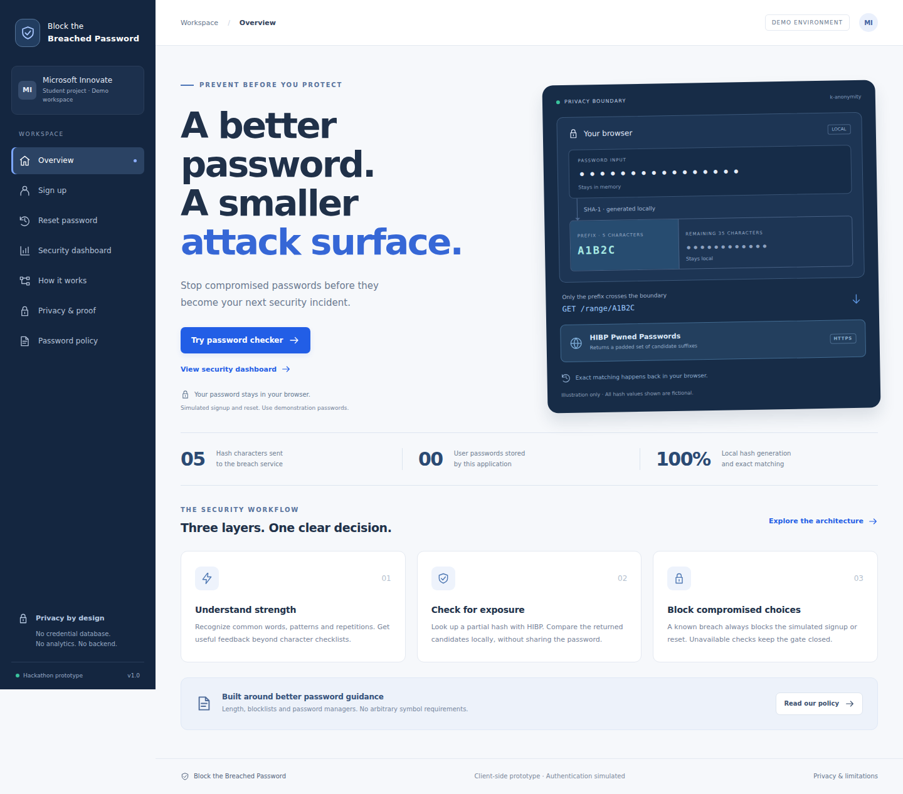

> **HELLO WORLD v1.5** — refreshed light/dark/system themes, clearer synthetic datasets, a teachable Test Lab and stronger freshness checks. Start with [v1.5 macOS update instructions](docs/UPGRADE-1.5-MACOS.md). The repository and Pages path remain `block-the-breached-password`.

> Version 1.2 adds a clearly labelled local 1,000-account benchmark and outage scenario. See [benchmark instructions](docs/BENCHMARK-1.2.md).

> Version 1.1 adds live prefix evidence and measured dashboard performance. See [upgrade instructions](docs/UPGRADE-1.1.md).

# HELLO WORLD

**Stop compromised passwords before they become your next security incident.**

A Microsoft Innovate hackathon prototype: a browser-only password-policy gate with HIBP Pwned Passwords, local strength feedback and a demonstration exposure dashboard.

> Authentication is simulated. No user account, login session, password database or real recovery flow is created. This project demonstrates privacy-preserving breach screening, not a production identity provider or NIST certification.

## Start here on your Mac

You do not need to copy source files manually or run create-vite.

1. Stop your old Phase 1 server with **Control+C** in its VS Code terminal.
2. Extract this ZIP into a **new folder**. Keep the Phase 1 folder as your backup.
3. In VS Code choose **File → Open Folder** and select the new `hello-world-complete` folder containing this README and `package.json`.
4. Open **Terminal → New Terminal** and run these commands one at a time:

```bash
npm install
npm run dev
```

Use **Node.js 24 LTS** and npm. Check with `node -v` and `npm -v`; install from https://nodejs.org/en/download if needed. Open the local address printed by Vite in Chrome, normally http://127.0.0.1:5173. Leave the terminal running. Internet is required for live HIBP lookups. No API key, account or backend configuration is needed.

To reproduce the exact dependency tree after the first installation, use `npm ci` instead of `npm install`.

## Problem and solution

A SaaS identity team needs to reject previously breached passwords during signup and reset without disclosing a proposed password to a breach service. Sending a whole password—or its entire fast hash—would unnecessarily reveal a useful secret or password fingerprint.

Our browser sends a five-character hash prefix, retrieves a group of candidate suffixes, and makes the exact comparison locally. Strength and breach status remain separate. A positive breach result always rejects the simulated submission; unknown results never count as clear.

## Features

- Overview, signup, reset, dashboard, Security Test Lab, architecture, privacy and policy screens.
- Reusable password component and security hook for both account flows.
- Local zxcvbn guessability estimate, show/hide, paste and password-manager support.
- Explicit HIBP checks; no request on every keystroke.
- AbortController cancellation plus revision tracking to ignore stale responses.
- Twelve-second request timeout; five-minute expiry timer plus independent submit-time timestamp validation.
- Strict response parsing; zero-count padding never matches.
- Policy validation at submission, in addition to disabled buttons.
- Live analysis of 20 or 100 test accounts, progress, cancel, filtering and pagination.
- Exportable JSON report containing only test IDs, decisions, timestamps and aggregates.
- In-memory, capped session activity; no claim of a durable or tamper-proof audit trail.
- Responsive light, dark and system themes, labelled controls, keyboard focus and reduced-motion support. Appearance stays in memory for the current page session; no browser storage is used.
- Explicit dataset composition: generated test accounts are not employee accounts.
- Run all nine Lab scenarios or one at a time, with expected/observed decisions and honest evidence scope.
- Printable reports, compatible JSON report comparison, guided walkthrough and explicit offline demonstration mode.
- GitHub Pages workflow runs lint, unit tests and browser tests before the repository-path build.

## First demonstration

1. Open **Sign up**.
2. Click **Load breached demo**. It loads a public test fixture and a fake email.
3. Click **Check password securely**. A positive HIBP match displays **Compromised password**; submission remains disabled.
4. Open Chrome DevTools with **Command+Option+I**, select **Network**, and filter `api.pwnedpasswords.com`.
5. Check again and inspect the request. Its path ends in five hexadecimal characters. No body, password or full hash is sent. An OPTIONS preflight can also appear.
6. Click **Generate random demo**, then run the check. If no match is found and policy passes, click **Simulate account creation**.
7. Try **Reset password** and matching/mismatched confirmation. Use the eye button to read a generated test value if needed; never demonstrate with a real password.
8. Open **Security dashboard**. Choose 20 accounts for a quicker walkthrough or 100 for the full report, then click **Run analysis**.
9. Export the non-sensitive report before leaving the dashboard. Navigation cancels analysis and clears that screen's results.
10. Open **How it works**, **Privacy & proof** and **Password policy**.

Live counts may change. Do not promise 23% before running the dataset. A result of “No known breach found” is not a guarantee of safety.

## Architecture and k-anonymity

The browser normalizes the prospective password, estimates guessability and computes SHA-1 using Web Crypto. The 40 hexadecimal characters are split into a five-character prefix and 35-character suffix. A direct HTTPS GET to `https://api.pwnedpasswords.com/range/{prefix}` returns candidate suffixes with occurrence counts. Local exact matching determines breach status.

The shared prefix groups possible hashes. Candidate-set sizes vary; this is not a fixed-k guarantee, zero knowledge, encryption or complete anonymity. The prefix leaks some information. HIBP also sees connection metadata, including IP address and request timing.

The request uses `Add-Padding: true`, omits credentials and referrer, prohibits redirects and requests no browser cache. The parser validates every response line and ignores zero-count padding. We do not require a fixed candidate count. Interactive results are not cached. Dashboard ranges are cached only in a per-run in-memory Map that is cleared at completion/cancellation.

SHA-1 is used solely for the HIBP lookup format. Nothing uses SHA-1 for password storage. A future identity service would need a separate secure credential-storage design, such as salted Argon2id, and appropriate operational controls.

## Privacy model

Application code never intentionally writes entered passwords or full hashes into URLs, logs, analytics, localStorage, sessionStorage, IndexedDB, reports or files. Inputs are controlled React state and temporary JavaScript values. zxcvbn returns some sensitive intermediate details; our wrapper retains only a numeric level, label and generic guidance.

On success and unmount, input references are cleared. JavaScript strings cannot be securely zeroed, so this is not a memory-erasure guarantee. A compromised browser, malicious extension or developer-tools session can inspect local data. Password managers are independently controlled by the user.

Production builds include a restrictive CSP meta tag. Vite preview adds CSP response headers including frame restrictions. `public/_headers` is a sample for hosts that support that format; other hosts must configure equivalent headers. Development mode includes Vite development machinery and is not a hardened hosting environment. There are no remote fonts or third-party analytics scripts.

## Password policy

Policy is designed around relevant final NIST SP 800-63B-4 password guidance, checked September 24, 2026. Implementation choices are documented in the Policy screen:

- 15–128 code points after NFC normalization; spaces allowed; no truncation.
- No mandatory character mix or strength-score threshold.
- Whole-value common/context blocklist plus live compromised-password checking.
- Paste, autofill and reveal controls.
- No routine expiry or security questions; production compromise recovery remains future work.

The 128 maximum and five-minute lookup expiry are prototype choices. NIST's password-only minimum is 15; MFA-only use can permit 8, and maximum support should reach at least 64. This is not full NIST compliance. The local example blocklist is deliberately small, not a complete production dictionary.

## Demonstration dataset

The 100-account run uses 23 entries drawn from five public common-password fixtures and 77 freshly generated 36-character hexadecimal values. The 20-account run uses 5 common fixtures and 15 random values. Each random value comes from 18 bytes of `crypto.getRandomValues` output. Common entries may repeat to represent reuse across accounts.

The public fixtures exist in source code and are not confidential credentials. This is an explicit demonstration exception to “no stored plaintext”: we never store collected user passwords. Generated values are produced one account at a time and excluded from every result row.

Analysis runs sequentially and reuses repeated prefixes during a run. A rate-limit response or three consecutive failures stops the batch. Errors become **unknown**, unprocessed rows remain **pending**. The percentage denominator is **successfully checked accounts**. Partial reports say they are incomplete. The dataset measures this synthetic sample, never a real organization.

## Tech stack

React, Vite, JavaScript, CSS, browser Web Crypto and zxcvbn. Custom SVG/CSS charts avoid a charting dependency. Node's built-in test runner covers core logic; Playwright covers browser interactions. Node is a development tool here, not a password-processing backend.

## Project structure

```text
src/
  components/    Reusable inputs, status, meter, navigation, flow and metric cards
  hooks/         usePasswordSecurity: current input, request lifecycle and stale guards
  pages/         Overview, shared account form, dashboard, architecture, privacy, policy
  services/      HIBP client and demonstration analysis runner
  utils/         Hashing, normalization/policy, strength wrapper and report calculations
  data/          Public demo fixtures, generator and navigation definitions
  tests/         Mocked core tests
  App.jsx        Page selection and non-sensitive session activity
  main.jsx       React entry point
  index.css      Stylesheet entry
  styles.css     Complete responsive design
public/_headers  Optional static-host security headers
e2e/            Mocked browser tests
 docs/           Beginner walkthrough, security review and presentation scripts
```

## Commands and tests

```bash
npm run dev        # Development server
npm run lint       # Code checks
npm test           # Core tests; no real HIBP calls
npm run build      # Build dist/ for a static HTTPS host
npm run preview    # Inspect production build locally
```

Browser tests, after building:

```bash
npx playwright install chromium
npm run test:e2e
```

All automated HIBP responses are mocked, including the 23% fixture report. Live failures never become approval and never automatically fall back to mock. The explicit offline mode allows only labelled mock simulations, not real authentication. Browser traces/videos/screenshots are disabled by default in the tests. Test credentials are public fixtures only.

The zxcvbn dictionary makes the JavaScript bundle comparatively large; Vite can display a bundle-size advisory. This does not mean the build failed. Page modules and the strength dependency are already deferred from the landing page. Moving strength evaluation to a worker is future work.

## Troubleshooting

| Problem                          | Fix                                                                                                           |
| -------------------------------- | ------------------------------------------------------------------------------------------------------------- |
| node/npm not found               | Install Node.js 24 LTS and reopen VS Code.                                                                    |
| package.json not found           | Open the extracted project folder itself, not its parent.                                                     |
| Vite missing                     | Run npm install in that folder.                                                                               |
| Old Phase 1 screen               | Stop the old server. Open this folder, restart, and use its printed URL.                                      |
| Port already used                | Stop the old process or use the alternate URL printed by Vite.                                                |
| Crypto unavailable               | Use Chrome on localhost/127.0.0.1 or HTTPS, not a file:// page or insecure remote HTTP address.               |
| Check unavailable                | Confirm internet access to HIBP; wait and retry. The gate stays closed. Do not disable CORS/browser security. |
| Submit disabled                  | Check length, common/context rule, email or confirmation, and a current no-match result.                      |
| Reset random demo does not match | Reveal the generated test value and copy it into confirmation, or type your own test passphrase.              |
| Dashboard stops early            | Errors are unknown. Wait, then rerun; the denominator never treats them as clear.                             |
| Browser test executable missing  | Run npx playwright install chromium before npm run test:e2e.                                                  |

## Screenshots

Preview: 

See `docs/screenshots/` for available previews. Replace/add these before submitting your final team deck:

- Overview desktop screenshot
- Breached signup state
- Successful simulated signup/reset
- Completed dashboard (label mocked results if captured with test data mocks)
- Architecture and Network tab evidence from your live demo

Never include actual user passwords or full user-password hashes in screenshots.

## Security limitations and future work

The UI gate is enforceable only within the intended client flow. A user can modify frontend code, so production must enforce policy at a trusted boundary. The dashboard is a demo screen, not an authenticated administrator portal. Audit events are volatile and mutable. There is no account ownership verification, email delivery, session management, backend rate limiting or credential storage.

HIBP cannot cover every breach or future exposure. NFC lookup describes the normalized value, not every historical Unicode encoding. A proxy, service compromise, malicious script or endpoint compromise can defeat aspects of the model. Network inspection supports a particular run; code review, tests and deployment controls provide additional evidence.

Future work: trusted authentication integration, authenticated reset tokens, passkeys/MFA, carefully designed server-side enforcement, role-based reporting, minimal durable audit records, monitored API availability and a maintained offline breach corpus. Do not retrofit a server that blindly trusts a browser's `breached: false` assertion.

## Presentation and learning materials

- [Start here](docs/START-HERE.md)
- [Beginner code walkthrough](docs/CODE-WALKTHROUGH.md)
- [Two-minute demo](docs/DEMO-2-MINUTES.md)
- [Five-minute presentation](docs/PRESENTATION-5-MINUTES.md)
- [Judge questions](docs/JUDGE-QA.md)
- [Security review and verification](docs/SECURITY-REVIEW.md)

## Team

- Team name: [Add your team name]
- Members and roles: [Add names and contributions]
- Institution: [Add institution]
- Mentor: [Add mentor]
- Repository/demo link: [Add after publication]

## Official references

- NIST final SP 800-63B-4: https://pages.nist.gov/800-63-4/sp800-63b/authenticators/#passwords
- HIBP Pwned Passwords: https://haveibeenpwned.com/API/v3#PwnedPasswords
- zxcvbn: https://github.com/dropbox/zxcvbn
- Vite: https://vite.dev/guide/

This is a student-built demonstration for Microsoft Innovate, not an official Microsoft or HIBP product.

## Version 1.3: Security Test Lab

The new **Security test lab** sidebar page runs nine local, synthetic scenarios through the shared hashing, strength, breach parser and policy engine. Test strong-but-exposed passwords and service failures, then export non-sensitive JSON evidence. This is explicitly a mock lab, not a live HIBP report or a security certification. See [upgrade guide](docs/UPGRADE-1.3.md) for the demo and installation instructions.

## Version 1.5

See [upgrade instructions](docs/UPGRADE-1.5-MACOS.md) and [validation](docs/VALIDATION-1.5.md). The existing detailed v1.4 learning guide is historical: v1.5 adds timestamp-based submission freshness, appearance controls, single-case Lab runs and dataset explanations. Authentication remains simulated. No employee-password collection or upload has been added.
